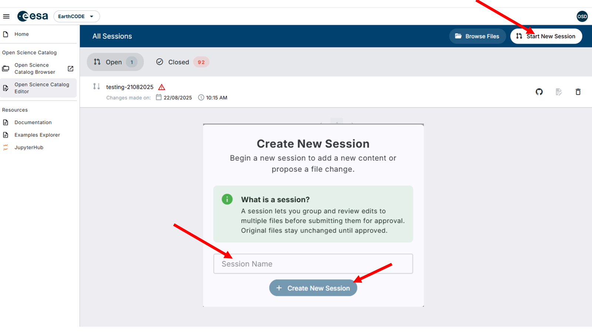
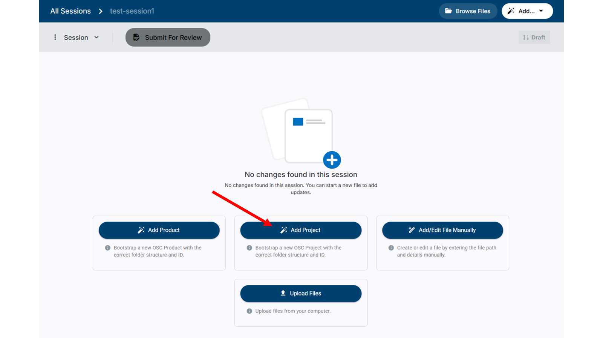
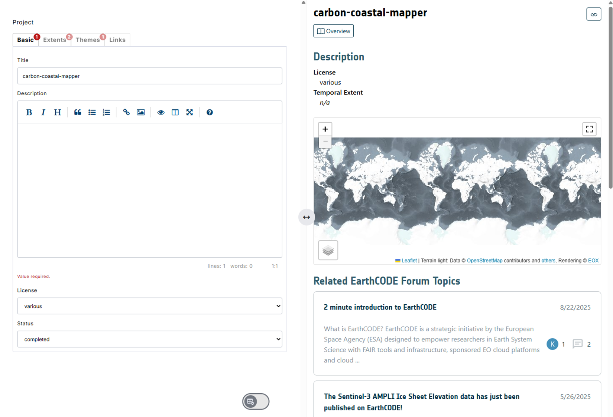
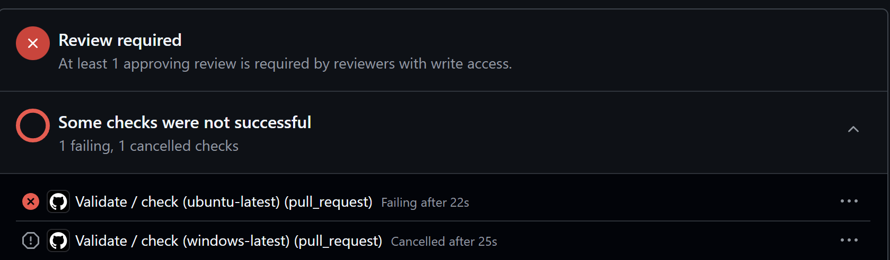
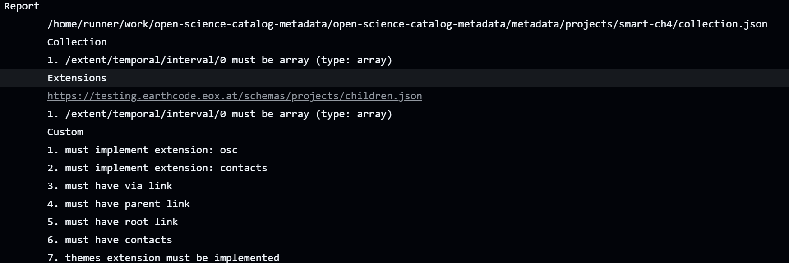

# Open Science Catalog Editor
A tutorial on how to use the Open Science Catalog Editor, A visual interface to the Open Science Catalog, to upload data.

1. First log in to  https://workspace.earthcode.eox.at/
2. Accept the required permissions, so that git-clerk can open PR requests from your github account in the OSC repository.
3. Click on the Open Science Catalog Editor.

## Starting with the OSC Editor

When you would like to add new entries, please start a new session (give it a meaningful name) and start with Adding New Project in the main page. 
Then you can proceed by providing the information directly in the form. 

Please see the steps with an example below:

You can find here a description of required metadata for projects/products etc.: https://esa-earthcode.github.io/documentation/Technical%20Documentation/Open%20Science%20Catalog/Open%20Science%20Catalog%20Overview

Once you have all the fields filled in you can submit the project and products metadata for review which will automatically open pull request, which will be checked and merged by our team. 

## In case of erorrs

The tool is basically a user interface to create a github pull request on your behalf. You can view the results of your entry here: https://github.com/ESA-EarthCODE/open-science-catalog-metadata/pulls. Whenever you create a pull request or branch we run an automatic validation to ensure your data conforms to the OSC schema.

**If the validation has failed you can manually inspect the errors**. If you click on the failed validation link (Validate / check (ubuntu-latest) ...) you can see the reasons for blocking the PR submissions.

For example, your errors might look like this:

In this case, the problems come from a missing:

- Temporal extent specification
- Missing contracts. 
- Missing links to your website and the eo4society page for the project.

You can ignore the missing extensions/parent/root link/ errors those should be resolved automatically.

## You can always ask the EarthCODE team for support if needed!