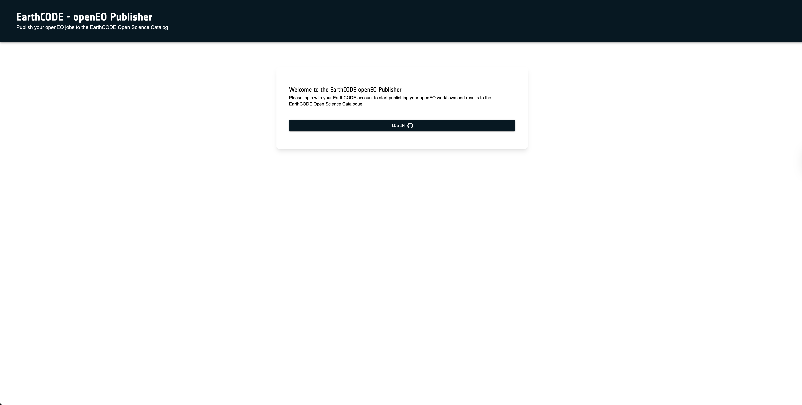
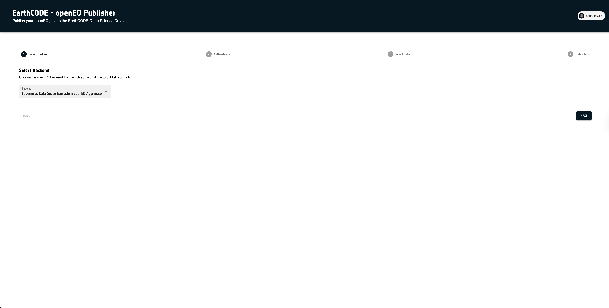
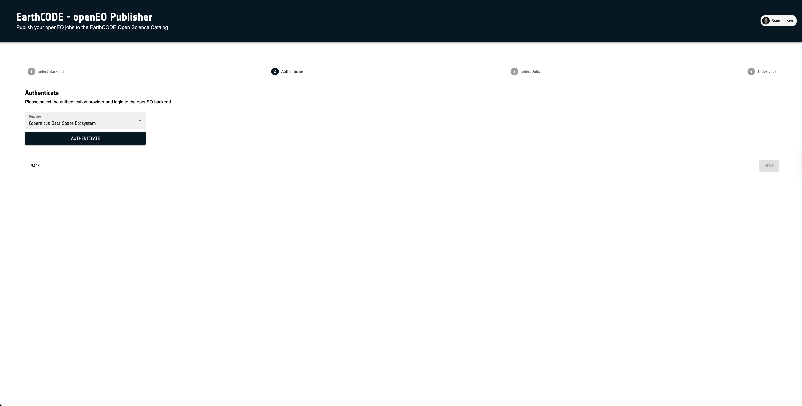
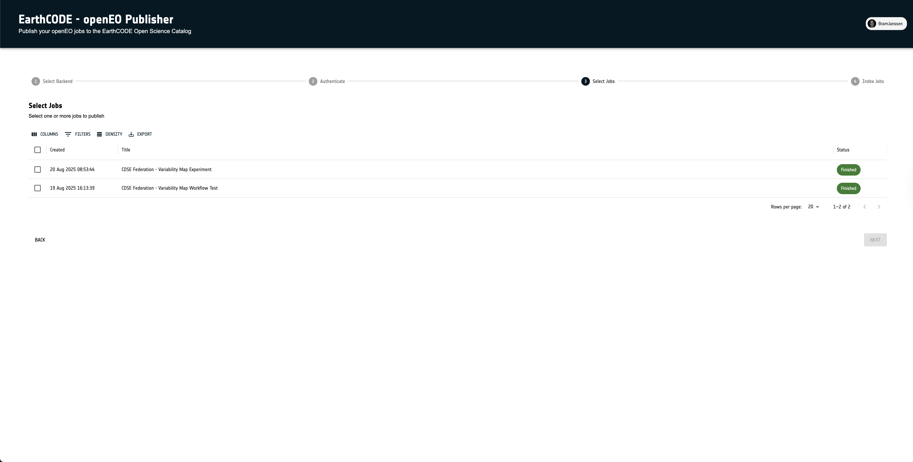
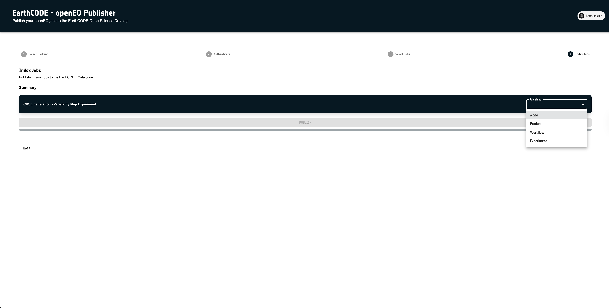
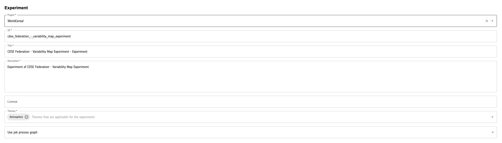
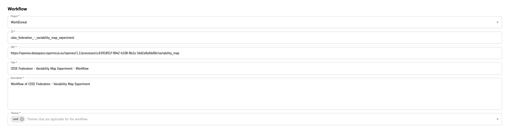
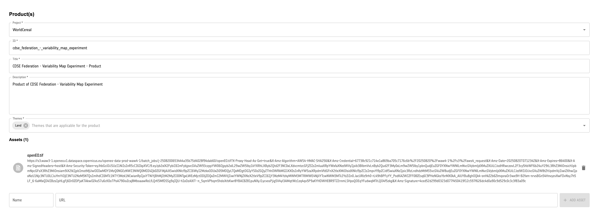
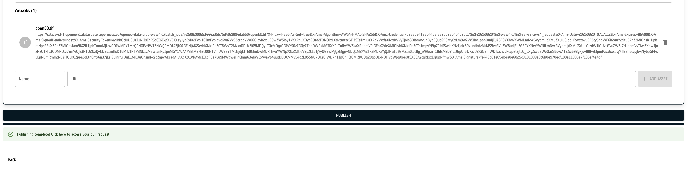
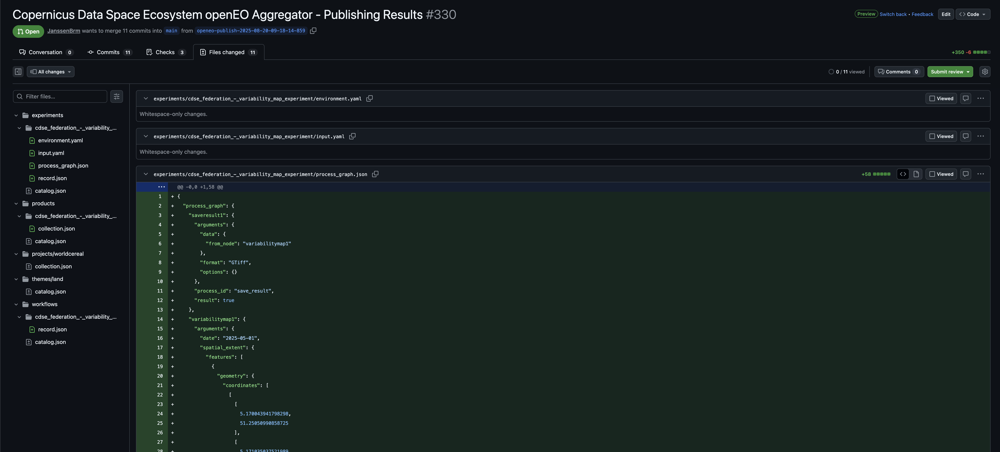

# Publishing an experiment to EarthCODE

In this guide we will explore the step needed to publish our [previously created](./2_experiment.ipynb) experiment to the EarthCODE Open Science Catalogue (OSC). To support this process, a dedicated tool, called the [openEO Publishing tool](https://publish.earthcode.vito.be/), has been created, which will guide you through the process of publishing the experiment. The publishing tool will create a GitHub pull request on the OSC with all the necessary information required to publish the experiment, including details about the product and the workflow. After approval of the pull request by the EarthCODE team, your experiment, its corresponding workflow and the resulting output products will become available in the catalogue for users to discover and reuse.

To start the publishing process, you can access the openEO Publishing tool at [publish.earthcode.vito.be](https://publish.earthcode.vito.be/). The tool will prompt you to log in using your GitHub account, which is necessary to create the pull request in the EarthCODE OSC repository.

Once logged in, you will need to select one of the supported openEO backends from which you want to publish your experiment. The tool currently supports the following backends:
- [Copernicus Data Space Ecosystem (CDSE) openEO Federation](openeofed.dataspace.copernicus.eu)

Click the **Next** button to proceed after selecting the backend. The openEO Publishing tool will then connect to the selected backend. If you are not already authenticated, you will be prompted to log in to the backend using your credentials. Clicking the **Authenticate** button will redirect you to the selected backend's authentication page, where you can log in with your credentials. Once authenticated, you will be redirected back to the openEO Publishing tool.
This step is necessary to retrieve the list of experiments that you have created on the selected backend. 

Now that you are authenticated, you can select the experiment you want to publish from the list of available jobs. The tool will display all the processing jobs associated with your account on the selected backend. You can select one or multiple experiments to publish. Click the **Next** button to proceed to the next step.

:::{hint}
The list of jobs only includes those that have been executed successfully. If you do not see your experiment in the list, make sure it has been executed and completed without errors.
:::

After selecting one or more jobs, you will be prompted to provide additional information about the experiment. First you will need to select if you want to publish the full experiment, only the workflow, or only the output products. The full experiment includes both the workflow and the output products, while selecting only the workflow or output products will publish only those components. 

Based on your selection, the tool will show a dedicated form to fill in the necessary details for the publication. Some of the fields are automatically filled in based on the experiment metadata retrieved from the platform, while others require manual input. The following sections describe the fields you need to fill in for each publication type.

**For experiments:**

- **Project**: The project under which the experiment is published. This should be a valid [EarthCODE project name](https://opensciencedata.esa.int/projects/catalog).
- **ID**: A unique identifier for the experiment.
- **Title**: A descriptive title for your experiment.
- **Description**: A detailed description of the experiment, including its purpose and methodology.
- **License** (optional): The license under which the experiment is published. This should be a valid license identifier.
- **Themes**: The thematic categories that best describe your experiment. You can select multiple themes from the provided list.
- **Experiment Process Graph**: Selection of the openEO process graph that represents your experiment. You can either choose to take the process graph from the selected job or refer to a public process graph URL that you have created previously.

**For workflows:**

- **Project**: The project under which the workflow is published. This should be a valid [EarthCODE project name](https://opensciencedata.esa.int/projects/catalog)
- **ID**: A unique identifier for the workflow.
- **URL**: The public URL of the openEO User Defined Process hat represents your workflow. This should be a valid URL pointing to a public process graph. See our tutorial on [creating a workflow](./1_workflow.ipynb) for more information on how to create a User Defined Process and get its URL.
- **Title**: A descriptive title for your workflow.
- **Description**: A detailed description of the experiment, including its purpose and methodology.
- **Themes**: The thematic categories that best describe your experiment. You can select multiple themes from the provided list.

:::{note}
Whenever you publish a workflow as part of an experiment, some of the above fields are covered by the experiment metadata. Therefore, you only need to fill in the fields that are not already provided by the experiment. Additionally in the case of an experiment, you can also choose to select an existing workflows from the list of workflows that are already available on the EarthCODE OSC.
:::

**For products:**

- **Project**: The project under which the product is published. This should be a valid [EarthCODE project name](https://opensciencedata.esa.int/projects/catalog)
- **ID**: A unique identifier for the product.
- **Title**: A descriptive title for your product.
- **Description**: A detailed description of the experiment, including its purpose and methodology.
- **Themes**: The thematic categories that best describe your experiment. You can select multiple themes from the provided list.
- **Assets**: A list of assets that part of the product. By default the result of the openEO job is automatically added to the list of assets. You can add additional assets by providing their URLs and a corresponding name. The assets should be publicly accessible URLs pointing to the output files generated by the experiment.

:::{note}
Whenever you publish a product as part of an experiment, some of the above fields are covered by the experiment metadata. Therefore, you only need to fill in the fields that are not already provided by the experiment.
:::

After filling in the necessary details, you can click the **Next** button to proceed to the final step. The openEO Publishing tool will then create a pull request on the EarthCODE OSC repository with all the information you provided. You will be able to access the pull request by clicking the link provided in the tool and track its status either through that link or on the [GitHub pull request page](https://github.com/ESA-EarthCODE/open-science-catalog-metadata/pulls). The pull request will contain all the necessary files and metadata required to publish your experiment, workflow, or product in the EarthCODE OSC.

Your experiment, workflow, or product will be now reviewed by the EarthCODE team. Once approved, it will be published in the EarthCODE Open Science Catalogue, making it available for other users to discover and reuse.